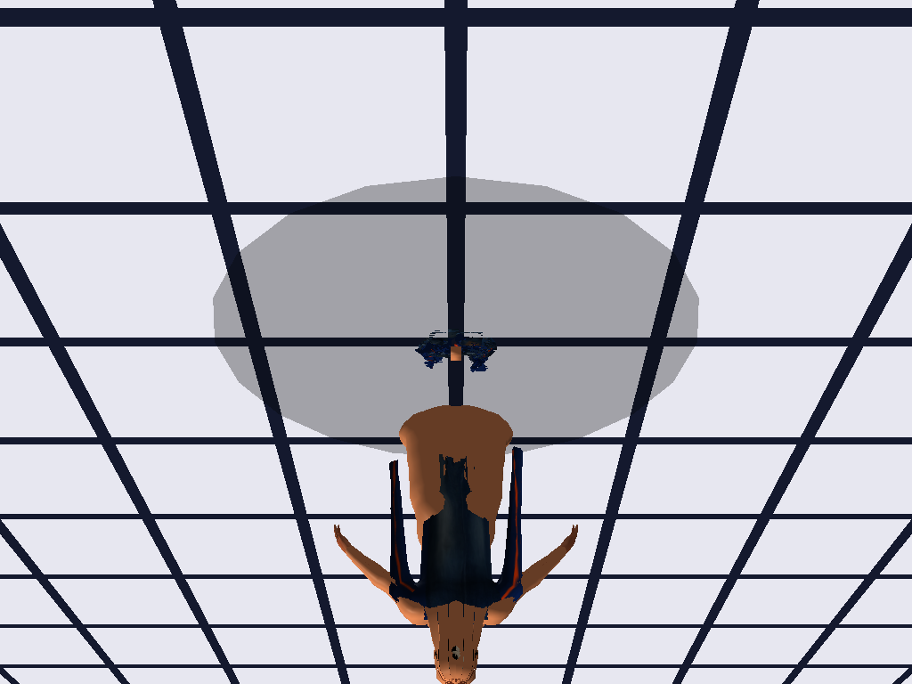
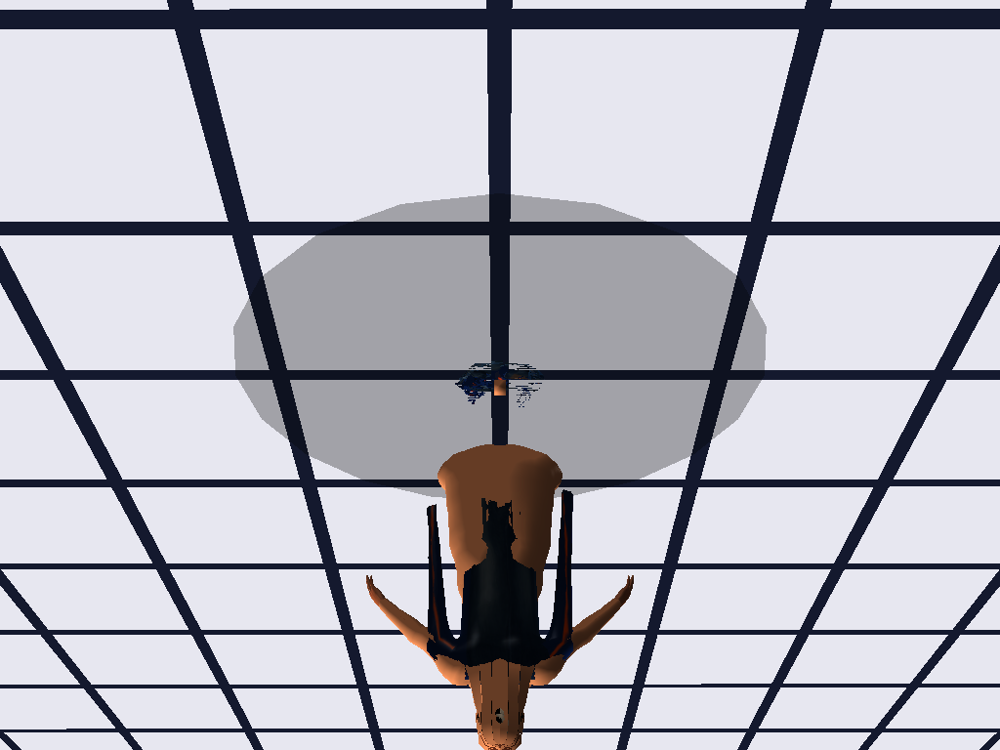
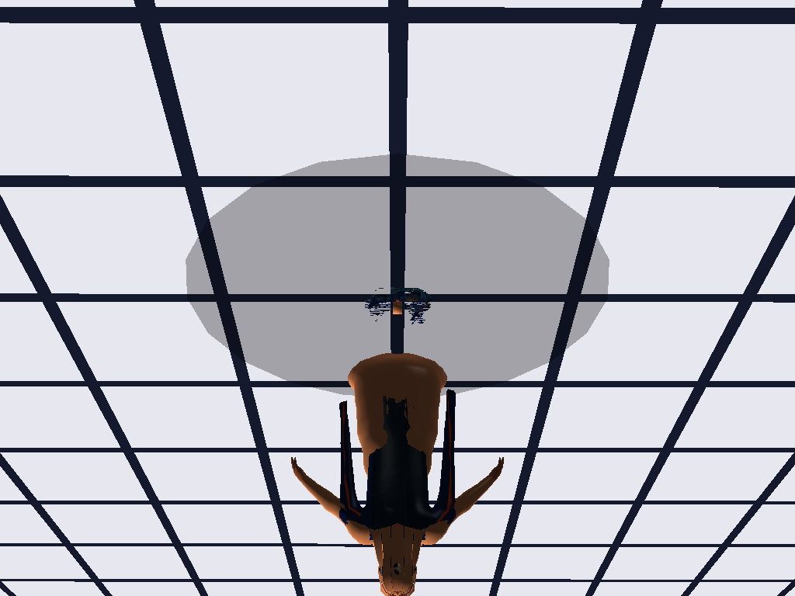
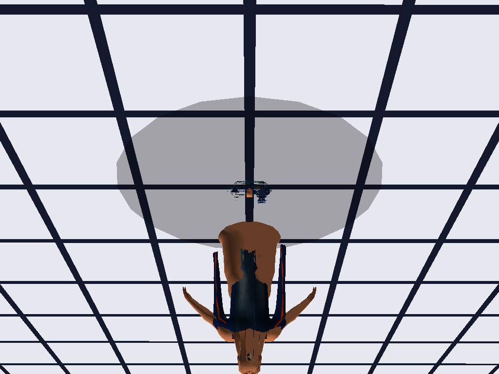
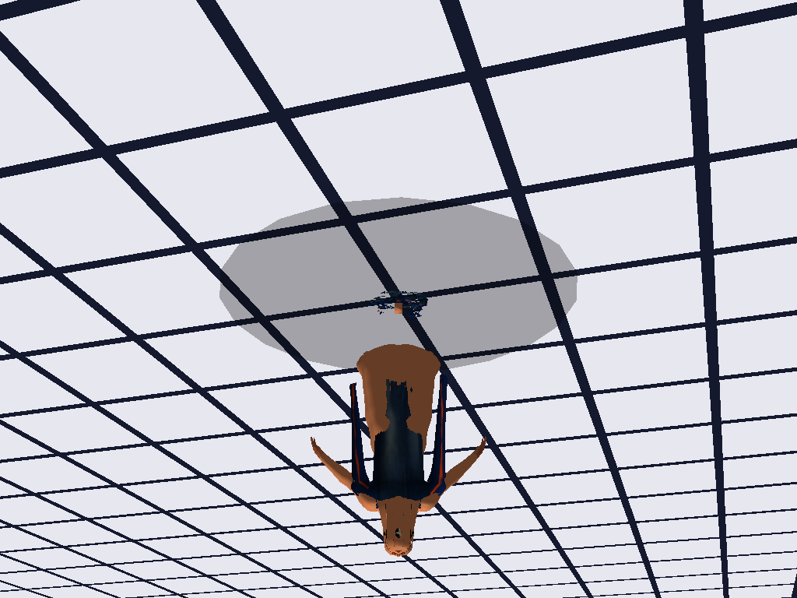
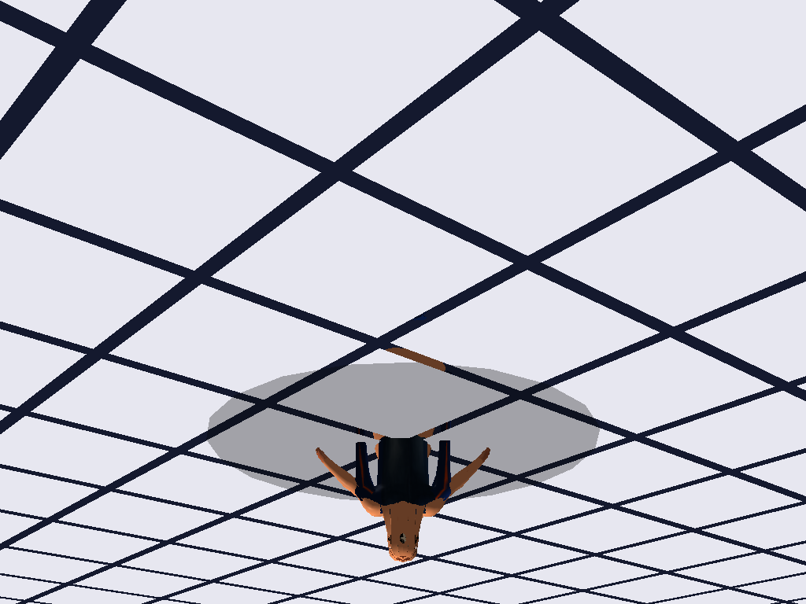

# Character Viewer — GLTF/GLB Skinned Character Renderer

A real-time 3D character viewer with skeleton skinning, animation playback, cloth physics,
third-person camera controls, and an ImGui-based in-game editor. Loads animated characters
from glTF 2.0 (`.glb`) files and renders them with OpenGL 3.3 core profile.

Built as part of a custom C++ OpenGL game engine (engine static library in `../engine/`).

## Features

### Rendering
- **GLB/GLTF loading** — cgltf-based, reads vertices, normals, UVs, joint indices/weights,
  inverse bind matrices, animation channels, PBR metallic-roughness materials
- **GPU skinning** — up to 80 bones via uniform array (`mat3x4 skinned[80]`)
- **Textures** — embedded GLB bufferView, sRGB-correct loading via stb_image
- **Skybox** — cubemap with daylight textures
- **Ground plane** — 40×40 tiled grid with visible gaps

### Animation
- **Multi-animation support** — load GLBs with multiple animations (idle, walk, run, etc.)
- **Distance-driven switching** — automatic transition between idle ↔ walk based on movement
- **Direction control** — forward/backward playback via `anim_dir`
- **Natural stop** — fast-forwards walk animation to nearest neutral frame (both feet on ground)
  when stopping, then transitions to idle
- **Baked cloth per animation** — cloth physics simulated offline per animation, played back
  with frame interpolation (zero runtime physics cost)

### Third-Person Camera
- **Mouse orbit** — click+drag rotates camera around the character (Y-axis only)
- **Camera-relative movement** — WASD moves character relative to camera view direction:
  `wish_dir.x = input.x·cos(θ) + input.z·sin(θ)`
  `wish_dir.z = input.z·cos(θ) - input.x·sin(θ)`
- **Character facing** — automatically rotates toward movement direction
  (`atan2f(wish_dir.x, wish_dir.z)` for +Z-facing models)

### Cloth Physics
- **CPU skinning** — cloth vertices skinned on CPU using stored joint/weight data
- **Dynamic VBO upload** — skinned positions uploaded to GPU each frame
- **Verlet integration** — spring-based simulation with wind, gravity, damping
- **Bone collision** — push cloth vertices away from influencing bones (sphere-based)
- **Baked playback** — offline pre-simulation for each animation at 30fps, runtime
  interpolation via `fmodf(anim_time, duration) → frame → lerp`
- **Fallback live sim** — runs live Verlet if no baked data is available for an animation

### In-Game Editor (ImGui)
- **UV/Material panel** — material selector, color tint (`ColorEdit3`), texture preview,
  UV wireframe overlay
- **Animation controls** — play/pause, time slider, animation selector
- **Bone viewer** — skeleton hierarchy with selected bone highlight
- **Screenshot** — `--screenshot <path>` flag renders 6 frames (4 idle angles + 2 walk poses) and saves as BMP

## Controls

| Key | Action |
|-----|--------|
| W / A / S / D | Move character (camera-relative) |
| Mouse drag | Orbit camera around character |
| Space | Play / Pause animation |
| F1 | Toggle editor mode |
| 1-9, 0, -, = | Select bone (editor mode) |
| [ ] | Previous / next bone |
| WASD / QE | Rotate bone (editor mode) |
| Shift | Fine rotation (editor mode) |
| K | Insert keyframe (editor mode) |
| R | Reset selected bone (editor mode) |
| ← → | Step keyframes (editor mode) |
| Ctrl+S / Ctrl+L | Save / Load animation (`.anim`) |

## Build

### Requirements
- Windows 10+
- Visual Studio 2022+ with C++17
- CMake 3.16+
- vcpkg with `glfw3`, `glew`, `imgui` installed

### Setup

```powershell
# Install dependencies
vcpkg install glfw3 glew imgui

# Build (from repo root)
cd opengl-engine
cmake -B build -DCMAKE_BUILD_TYPE=Release
cmake --build build --target character --config Release
```

The project expects the `engine` static library in `../engine/`. Build it first:

```powershell
cmake --build build --target engine --config Release
```

### Run

```powershell
cd build\character\Release
character.exe
```

Optional: `--screenshot <path.bmp>` to render 6 frames (4 idle camera angles + 2 walk poses) to BMP files (`<path>_front.bmp`, `_left.bmp`, `_back.bmp`, `_right.bmp`, `_walk_fwd.bmp`, `_walk_side.bmp`) and exit.

## Pipeline

The character GLB is generated via Blender 5.1 + the MPFB addon from MakeHuman data.
Pipeline scripts are in `../engine/scripts/`:

1. **`export_complete_character.py`** — creates a human with MPFB, applies the
   `game_engine` rig (53 bones), converts and loads clothes/hair from `.mhpxy`/`.npz`
   format, replaces materials with Principled BSDF, applies transforms on clothes/hair
   meshes to eliminate Z-offset, packs textures, and exports as `combined_character.glb`
2. **`generate_idle_animation.py`** — generates a procedural 60-frame breathing animation
3. **`generate_walk_cycle.py`** — generates a procedural 30-frame walk cycle (sine-based
   bone oscillations for thighs, calves, feet, arms, spine, root bounce)
4. **`merge_animation.py`** — merges idle + walk animations into the character GLB

For automation:
```powershell
.\engine\scripts\build_character.bat
```

### Available Assets
- **Clothes:** male_casualsuit01-06, male_elegantsuit01, male_worksuit01,
  female_casualsuit01-02, female_elegantsuit01, female_sportsuit01, shoes01-06
- **Hair:** afro01, bob01-02, braid01, long01, ponytail01, short01-04
- **Skins:** 18 variations (young/middleage/old × african/asian/caucasian × male/female)

## Screenshots

| Front | Left | Back | Right |
|-------|------|------|-------|
|  |  |  |  |

| Walk Forward | Walk Side |
|--------------|-----------|
|  |  |

*Screenshots captured using the `--screenshot` flag in headless mode.*

## Project Structure

```
character/
├── main.cpp                   # Complete viewer (~2300 lines)
├── CMakeLists.txt             # CMake build (links engine + imgui)
├── cgltf.h                    # glTF 2.0 loader (single header, 260 KB)
├── stb_image.h                # Image decoder for embedded textures
├── stb_truetype.h             # Font renderer for editor UI
├── imgui_impl_opengl3.cpp     # ImGui OpenGL3 backend
├── imgui_impl_opengl3.h       # ImGui OpenGL3 backend header
├── animated_character.glb     # Character with merged idle + walk animations
├── skybox/                    # Daylight cubemap textures
├── screenshots/               # Generated screenshots
└── *.anim                     # Saved keyframe animation files
```

## Technical Details

### Math
- Custom column-vector 4×4 matrix (`mat4`) and 3×4 bone matrix (`mat3x4`)
- Quaternion utilities
- `compute_skin()` computes `bone_world = parent_world × local` (column-vector),
  then `skin = bone_world × inverse_bind_matrix`, uploaded as `mat3x4[80]`

### Cloth
- Mesh 2 is treated as cloth (highest material index), detected by presence of
  `cloth_jw` (joint-weight data for CPU skinning)
- Springs: structural (2,000+), shear (1,000+), bend (500+), pin (top 15% of Y)
- Baked at 30fps with 6 substeps and 1-second pre-settle per animation
- Stored in `BakedCloth g_baked[4]` — `frames[][]`, `fps`, `duration`, `ready`
- Runtime: `fmodf(anim_time, duration) → frame index → lerp` — zero physics at runtime

### Render Order
- Two-pass rendering: clothes/hair first (pass 0), body with polygon offset (pass 1)
  to prevent z-fighting while keeping clothes on top
- Cloth rendered separately via CPU-skinned VBO with physics shader

### Animation System
- `anim_time` global float tracks position in current animation
- `cur_anim` selects animation index (0 = idle, 1 = walk)
- `anim_dir` controls direction (1 = forward, -1 = reverse, 0 = paused)
- Distance-driven: `anim_dt = dist_moved × 0.67` maps world distance to animation speed
- Natural stop: when stopping, advances walk at 4× until `anim_time ≈ 0` (neutral pose),
  then switches to idle

## License

MIT
